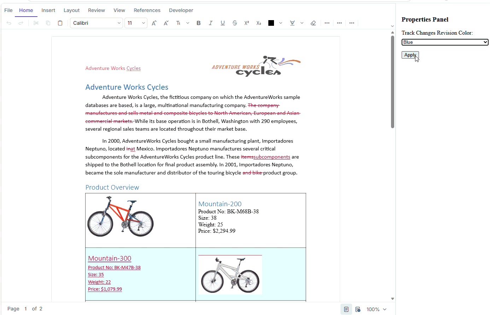

# Customize Track Changes Color in React DOCX Editor

## Introduction

This sample demonstrates how to customize the **Track Changes revision color** in the Syncfusion<sup style="font-size:70%">&reg;</sup> [React DOCX Editor](https://www.syncfusion.com/docx-editor-sdk/react-docx-editor?utm_source=github&utm_medium=listing&utm_campaign=github-github-documenteditor-examples) (Document Editor). Users can select a revision color from the properties panel and apply it to tracked changes in the document.

## Project Features

- Load a document containing tracked changes.
- Enable Track Changes in the Document Editor.
- Select a custom revision color.
- Apply the selected color to tracked changes at runtime.

## How to Run the Sample

### Prerequisites

- Node.js and npm installed.

### Steps

1. Open the project directory:

```bash
cd revsion-colors-in-react-docx-editor
```

2. Install the dependencies:

```bash
npm install
```

3. Start the application:

```bash
npm run dev
```

4. Open the URL shown in the terminal, typically:

```text
http://localhost:5173
```

### Build for Production

```bash
npm run build
```

## Demo

The sample displays a DOCX document with tracked changes.

1. Open the sample in the browser.
2. Select a color from the **Track Changes Revision Color** section in the properties panel.
3. Click **Apply**.
4. The tracked changes in the document are displayed using the selected color.

<p align="center">
  
</p>


## Resources

- **Product page:**   [Syncfusion® React DOCX Editor](https://www.syncfusion.com/docx-editor-sdk/react-docx-editor?utm_source=github&utm_medium=listing&utm_campaign=github-github-documenteditor-examples) 

- **Documentation:**   [Syncfusion® React DOCX Editor - Documentation](https://help.syncfusion.com/document-processing/word/word-processor/react/overview?utm_source=github&utm_medium=listing&utm_campaign=github-github-documenteditor-examples) 

- **Online demo:**   [Syncfusion® React DOCX Editor - Online demo](https://document.syncfusion.com/demos/docx-editor/react/#/tailwind3/document-editor/default?utm_source=github&utm_medium=listing&utm_campaign=github-github-documenteditor-examples) 

## Support and feedback 

For any other queries, reach our [Syncfusion® support team](https://support.syncfusion.com/?utm_source=github&utm_medium=listing&utm_campaign=github-github-documenteditor-examples) or post the queries through the [community forums](https://www.syncfusion.com/forums?utm_source=github&utm_medium=listing&utm_campaign=github-github-documenteditor-examples). 

Request new feature through [Syncfusion® feedback portal](https://www.syncfusion.com/feedback?utm_source=github&utm_medium=listing&utm_campaign=github-github-documenteditor-examples). 

## License

This is a commercial product and requires a paid license for possession or use Syncfusion's licensed software, including this component, is subject to the terms and conditions of [Syncfusion's EULA](https://www.syncfusion.com/license/studio/syncfusion_essential_studio_eula.pdf?utm_source=github&utm_medium=listing&utm_campaign=github-github-documenteditor-examples). You can purchase a licnense [here](https://www.syncfusion.com/sales/products?utm_source=github&utm_medium=listing&utm_campaign=github-github-documenteditor-examples) or start a free 30\-day trial [here](https://www.syncfusion.com/account/manage-trials/start-trials?utm_source=github&utm_medium=listing&utm_campaign=github-github-documenteditor-examples). 